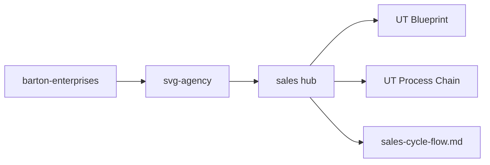
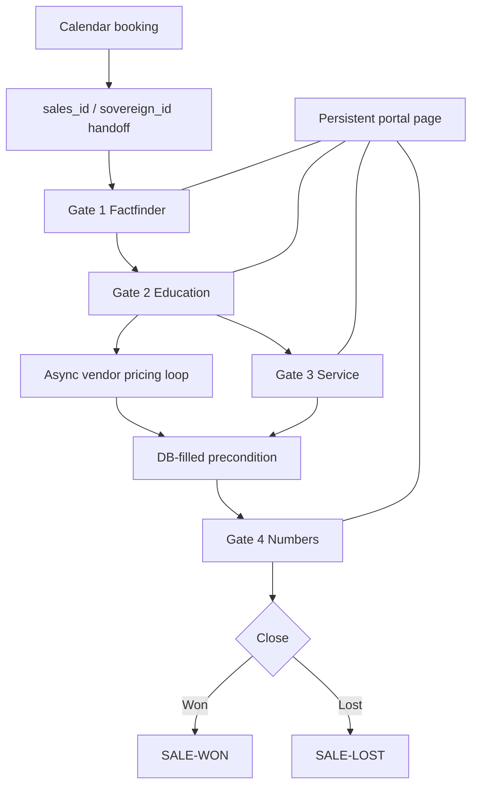
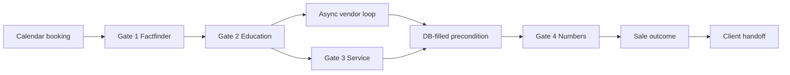

# Sales Process UT Blueprint
## Hub-level blueprint for the Sales Navigator sales system, its data surfaces, and its boundary rules.
### Status: BUILD
### Medium: repository
### Business: svg-agency

> Legacy references: [CONSTITUTION.md](./CONSTITUTION.md), [docs/PRD.md](./docs/PRD.md), and [docs/OSAM.md](./docs/OSAM.md) are superseded by this blueprint and kept for history only.

---

## UT Checklist (Pre-Flight - per law/UT_CHECKLIST.md v1.2.0)

| # | Check | Status | Location |
|---|-------|--------|----------|
| 1 | PRD - what / why / who / scope / out-of-scope / success metric | [ ] | §2 |
| 2 | OSAM - READ / WRITE / Process Composition / Join Chain / Forbidden Paths / Query Routing filled | [ ] | §5 |
| 3 | Component Status - every dep green / amber / red with 1-line state | [ ] | §3 |
| 4 | Owner - human who fixes this at 2 AM | [ ] | §1 |
| 5 | Live Dashboard - URL or explicit "N/A" | [ ] | §3 |
| 6 | Kill Switch - exact command to stop the process | [ ] | §8 |
| 7 | Logbook - last audit verdict + date (after certification only) | [ ] | §12 |
| 8 | FCEs Attached - which FCE runs structurally back this doc | [ ] | §3c |
| 9 | BARs Referenced - every BAR this doc touches, with status | [ ] | §3d |
| 10 | LBB Subjects Fed - which LBB subject(s) this doc's session logs go to | [ ] | §3e |
| 11 | Geometry - CTB position + Hub-Spoke role + Altitude | [ ] | §1b |
| 12 | Live Verification - every numeric count, cron, URL, command, BAR status grounded against the actual system | [ ] | §9b |
| 13 | ctb_node - declared path on the Barton Enterprises CTB trunk | [ ] | §1 Identity |

---

# IDENTITY (Thing - what this IS)

## 1. IDENTITY

| Field | Value |
|-------|-------|
| ID | DOC-SALES-BLUEPRINT |
| Name | Sales Process UT Blueprint |
| Medium | repository |
| Business Silo | svg-agency |
| CTB Position | branch -> hub -> barton-enterprises/svg-agency/sales |
| ORBT | BUILD |
| Strikes | 0 |
| Authority | inherited - imo-creator-v2, CONSTITUTION.md, PRD.md, OSAM.md |
| Last Modified | 2026-04-22 |
| BAR Reference | BAR-NEW (pending) |
| Owner | Dave Barton |
| ctb_node | barton-enterprises/svg-agency/sales |

### 1b. Geometry (Checklist item 11)

**CTB Position:** `barton-enterprises/svg-agency/sales` - hub-level blueprint for the Sales Navigator surface

**Hub-Spoke Role:** hub - the Middle where routing rules, schema boundaries, and cross-doc contracts live

**Altitude:** 30k tactical



### HEIR (8 fields - Aviation Model)

| Field | Value |
|-------|-------|
| sovereign_ref | SOV-SVG-AGENCY |
| hub_id | HUB-SALES-NAV-20260130 |
| ctb_placement | branch |
| imo_topology | middle |
| cc_layer | CC-02 |
| services | Cloudflare D1, Neon PostgreSQL, Cloudflare Workers, Cloudflare Pages, MapEngine |
| secrets_provider | doppler |
| acceptance_criteria | All 14 sections filled, all joins route through sales_id, legacy docs marked superseded, no direct cross-sub-hub joins |

### Fill Rule

The blueprint must declare the hub-level identity, CTB position, owner, HEIR, and hub boundary without guessing or mixing runtime code into the repo-level contract.

---

## 2. PURPOSE (PRD)

### WHAT
This blueprint is the hub-level contract for the Sales Process repository. It declares the sales-cycle architecture, the data surfaces it governs, and the boundaries it does not cross.

### WHY
Without this blueprint, the sales process docs drift into separate stories about the same workflow, which breaks the shared spine, the query routing, and the handoff into the client hub.

### WHO
Dave Barton, the sales agent workflow, the 900-sales-portal process, the client mint/intake/export/portal chain, and the auditors who need one authoritative hub reference.

### SCOPE (in)
- Govern the four-meeting sales cycle as a single hub contract
- Define the shared `sales_id` spine and the allowed joins around it
- Declare the process chain, diagram, and data surfaces that belong to sales
- Mark the legacy Constitution, PRD, and OSAM as superseded without deleting them

### OUT-OF-SCOPE
- CRM source data mutation
- Payment processing
- Contract generation
- Legal compliance

### SUCCESS METRIC
Percentage of `SALE-G1` prospects that reach `SALE-WON`, with every gate still routed through the same `sales_id` spine.

### Fill Rule

The purpose block must answer what the blueprint delivers, what starves without it, who reads it, what is in scope, what is out of scope, and the single success metric.

---

## 3. RESOURCES

### Component Status Grid

| Component | HEIR (`hub_id · ctb_placement · cc_layer`) | ORBT | Light | State |
|-----------|-------------------------------------------|------|-------|-------|
| [CONSTITUTION.md](./CONSTITUTION.md) | HUB-SALES-NAV-20260130 · branch · CC-01 | OPERATE | green | Legacy law, retained for history and now superseded by this blueprint |
| [docs/PRD.md](./docs/PRD.md) | HUB-SALES-NAV-20260130 · branch · CC-02 | OPERATE | green | Legacy transformation declaration, retained for history |
| [docs/OSAM.md](./docs/OSAM.md) | HUB-SALES-NAV-20260130 · branch · CC-02 | OPERATE | green | Legacy query-routing contract, still useful for cross-checking |
| [Barton-Processes/factory/sales/900-sales-portal/PROCESS.md](../Barton-Processes/factory/sales/900-sales-portal/PROCESS.md) | PROC-900 · leaf · CC-04 | BUILD | amber | Runtime sales portal process that executes the four meetings |
| [Barton-Processes/factory/client/800-client-mint/PROCESS.md](../Barton-Processes/factory/client/800-client-mint/PROCESS.md) | PROC-800 · leaf · CC-04 | BUILD | amber | Downstream mint from sales into client identity |
| [Barton-Processes/factory/client/810-client-intake/PROCESS.md](../Barton-Processes/factory/client/810-client-intake/PROCESS.md) | PROC-810 · leaf · CC-04 | BUILD | amber | Downstream intake and routing after mint |
| [Barton-Processes/factory/client/820-vendor-export/PROCESS.md](../Barton-Processes/factory/client/820-vendor-export/PROCESS.md) | PROC-820 · leaf · CC-04 | BUILD | amber | Downstream vendor export after client handoff |
| [Barton-Processes/factory/client/830-client-portal/PROCESS.md](../Barton-Processes/factory/client/830-client-portal/PROCESS.md) | PROC-830 · leaf · CC-04 | BUILD | amber | Downstream client portal and service surface |
| [docs/blueprints/sales-cycle-flow.md](./docs/blueprints/sales-cycle-flow.md) | DIAG-SALES-CYCLE · leaf · CC-02 | BUILD | amber | Visual companion for the full sales cycle |
| vendor_capability_registry | SALES-VENDOR-REGISTRY · branch · CC-03 | BUILD | amber | Planned read surface for vendor capability metadata |

### Live Dashboard

| Resource | URL | What it shows |
|----------|-----|---------------|
| Mission Control MapEngine - Sales Layers | `https://mission-control.svg-outreach.workers.dev/map-engine` (layer filters: `SVG-SALES`, `SALE-G1`, `SALE-G2`, `SALE-G3`, `SALE-G4`, `SALE-WON`, `SALE-LOST`, `SALE-STALLED`) | Live view of every sales_state record on geographic + gate-color layers. Driven by `map_layer_registry` rows (Sub-hub 29, BAR-329). |
| Prospect Portals | `svg.agency/p/{sales_slug}` (one URL per `sales_id`) | Per-prospect portal with progressive-unlock gates, meeting minutes, and Gate 4 proposal surface. |
| CF Stream Library | `fleet/content/videos/MANIFEST.md` + iframe embeds `https://iframe.videodelivery.net/{uid}` | The 4 sales-cycle videos (Gate 1-4) with watch-% telemetry feeding `video_watched` on `meeting_checklist`. |

### Dependencies

| Dependency | Type | What It Provides | Status |
|-----------|------|------------------|--------|
| `outreach_company_target` | D1 table | Prospect company intake | DONE |
| `outreach_dol` / 5500 cache | D1 table | Renewal and benefit prefill | DONE |
| `outreach_people` / slot tables | D1 table | CEO / CFO / HR contact prefill | DONE |
| `outreach_blog` | D1 table | Context and movement signals | DONE |
| `sales_state` | D1 table | Spine and phase router | DONE |
| `sales_factfinder` | D1 table | Gate 1 data surface | DONE |
| `sales_insurance` | D1 table | Gate 2 data surface | DONE |
| `sales_systems` | D1 table | Gate 3 data surface | DONE |
| `sales_quotes` | D1 table | Gate 4 data surface | DONE |
| `meeting_transcript` / `meeting_points` | D1 tables | First-class meeting memory | PLANNED |
| `vendor_capability_registry` | database surface | Vendor metadata and capability lookup | PLANNED |

### Downstream Consumers

| Consumer | What It Needs |
|----------|---------------|
| Sales portal runtime | The four-meeting routing contract and the shared spine |
| Client mint/intake/export/portal chain | The handoff contract after `SALE-WON` |
| Auditors | One authoritative place for the hub boundary and joins |
| Diagram companion | The cycle nodes and trigger types |

### Tools & Integrations

| Item | Type | Cost Tier | Credentials | What It Does |
|------|------|-----------|-------------|-------------|
| Cloudflare D1 | database | Cheap | wrangler binding | Working sales tables and fast reads |
| Neon PostgreSQL | vault database | Cheap | Doppler connection string | Read-only upstream source and long-term vault |
| Cloudflare Workers | runtime | Free | none | Server-side sales portal execution |
| Cloudflare Pages | surface | Free | none | Prospect-facing rendering surface |
| MapEngine | dashboard | Internal | none | Sales layers and CTB overlays |

### Secrets

| Secret | Doppler Project | Config | Used By |
|--------|----------------|--------|---------|
| `SALES_DATABASE_URL` | imo-creator | dev | Sales vault / schema references |
| `NEON_URL` | sales-navigator | dev | Upstream outreach reads and snapshot pulls |

### Peer Cross-Links (per dispatch DISPATCH_UT_SALES_REPAIR_2026-04-22.md)

| Peer Artifact | Role | Path |
|---------------|------|------|
| Process UT | Operational sibling - 10k altitude execution manual for the 4-gate cycle | `Barton-Processes/factory/sales/UT_PROCESS.md` |
| Blueprint Diagram | Visual companion - mermaid flowchart of the cycle | `Sales Process/docs/blueprints/sales-cycle-flow.md` |
| Dispatch (this) | Work order that governs these artifacts | `imo-creator-v2/factory/dispatch/DISPATCH_UT_SALES_REPAIR_2026-04-22.md` |
| Audit Report | Gate 3 audit verdict + findings | `imo-creator-v2/law/doctrine/AUDITS/SALES_UT_AUDIT_2026-04-22.md` |

### Fill Rule

The resources section must list the live dependencies, the dashboard surface, the downstream consumers, the tools, and the secrets that keep the hub readable.

---

## 4. IMO - Input, Middle, Output

### Two-Question Intake
1. What triggers this? A sales handoff event or a manual request to inspect the hub.
2. How do we get it? Resolve the `sales_id` from the CL pipeline or from hand entry, then route through the gate tables and the portal contract.

### Input
- Calendar booking event
- Sales handoff payload
- Prospect data from outreach
- `sales_id` and `sovereign_id`
- Meeting checklist seed and transcript memory

### Middle

| Step | Input | What Happens | Output | Tool Used |
|------|-------|-------------|--------|-----------|
| 1 | Calendar booking event | Mint the sales instance and anchor the spine | `sales_id` | D1 write |
| 2 | `sales_id` + outreach snapshot | Pre-fill Gate 1 and attach the checklist row | Factfinder draft | D1 read/write |
| 3 | Gate 1 completion | Queue Gate 2 video and start the vendor loop fork | Gate 2 ready state | SendGrid-style sequence |
| 4 | Gate 2 fork | Capture `quote it?` yes/no and create vendor request rows | Vendor pricing requests | Cron + D1 |
| 5 | Gate 3 completion | Capture service details and keep the portal locked to the next gate | Service state | Portal + transcript |
| 6 | DB-filled precondition | Wait for all vendor rows and Monte Carlo inputs to settle | Gate 4 ready state | Precondition gate |
| 7 | Gate 4 presentation | Show the numbers and proposal | `SALE-WON` or `SALE-LOST` | Portal + Monte Carlo output |

### Output
- A deterministic four-gate sales record
- A prospect portal that stays live across the full cycle
- A clean handoff into the client hub when the sale closes

### Circle
The transcript, checklist state, vendor replies, and proposal output all feed back into the next gate and into the portal page so the cycle learns instead of stalling.

### Architecture Diagram



### Fill Rule

The IMO section must show the trigger, the source of the input, the ordered transformation, the output, and the feedback loop that keeps the cycle closed.

---

## 5. DATA SCHEMA / OSAM

### READ Access

| Source | What It Provides | Join Key |
|--------|------------------|----------|
| `outreach_company_target` | company profile and location | `sovereign_id` |
| `outreach_dol` | 5500 / renewal / funding prefill | `sovereign_id` |
| `outreach_people` / slot tables | decision-maker contacts | `sovereign_id` |
| `outreach_blog` | movement and context signals | `sovereign_id` |
| `sales_state` | phase router and spine | `sales_id` |
| `sales_factfinder` | Gate 1 canonical state | `sales_id` |
| `meeting_checklist` | gate status and queue state | `sales_id` |
| `meeting_transcript` | timestamped meeting memory | `sales_id` |
| `meeting_points` | asked for / provided / committed / objection / decision atoms | `sales_id` |
| `vendor_capability_registry` | vendor metadata and capability lookup | `vendor_id` |
| `vendor_quote_response` | quote results and response state | `sales_id` + `vendor_id` |
| `monte_carlo_output` | proposal numbers and deltas | `sales_id` |

### WRITE Access

| Target | What It Writes | When |
|--------|---------------|------|
| `sales_state` | `current_phase`, stall state, close state | every gate transition |
| `meeting_checklist` | scheduled, video_sent, watched, meeting_done, next_booked, followup_sent | every meeting event |
| `factfinder_draft` | Gate 1 capture output | Gate 1 save |
| `meeting_transcript` | raw transcript text and timestamps | every recorded meeting |
| `meeting_points` | extracted meeting atoms | after each meeting |
| `vendor_pricing_requests` | async quote requests | after Gate 2 fork |
| `vendor_quote_response` | parsed vendor replies | cron-driven vendor loop |
| `monte_carlo_input` | exact cells for the proposal | after vendor rows settle |
| `monte_carlo_output` | deterministic proposal output | before Gate 4 |

### Process Composition



| Process ID | Name | Role in Composition | Status |
|-----------|------|---------------------|--------|
| PROC-900 | Sales Portal | this repo's runtime executor | BUILD |
| PROC-800 | Client Mint | downstream handoff after close | BUILD |
| PROC-810 | Client Intake | downstream routing after mint | BUILD |
| PROC-820 | Vendor Export | downstream file export after intake | BUILD |
| PROC-830 | Client Portal | downstream client-facing surface | BUILD |

### Join Chain

```text
calendar booking
  -> sales_state.sales_id
    -> meeting_checklist.sales_id
      -> factfinder_draft.sales_id
        -> vendor_pricing_requests.sales_id
          -> vendor_quote_response.sales_id
            -> monte_carlo_input.sales_id
              -> monte_carlo_output.sales_id
                -> client_handoff.sales_id
```

### Forbidden Paths

| Action | Why |
|--------|-----|
| Direct cross-sub-hub joins | The spine must remain the only join path |
| Writing Gate 2-4 before Gate 1 closes | Gate order is the contract |
| Exporting vendor quotes before the invoice-backed line exists | Quote loop is async and row-based |
| Mutating CRM source data | This hub consumes, it does not own the CRM |
| Rendering the portal without transcript / checklist state | The portal must mirror the actual gate state |

### Query Routing

| Question | Table | Column |
|----------|-------|--------|
| What gate is next? | `meeting_checklist` | `next_booked` |
| What did we discuss? | `meeting_transcript` / `meeting_points` | `text` / `category` |
| What quotes are ready? | `vendor_quote_response` | `status`, `parsed_payload` |
| Is the precondition satisfied? | `monte_carlo_input` | completeness flags |
| What does HR see at Gate 4? | `monte_carlo_output` + portal view | proposal summary |
| What is the prospect's current phase? | `sales_state` | `current_phase` |

### Portal Render Contract

| Gate | What HR Sees |
|------|--------------|
| Gate 1 | Factfinder summary, DOL prefill, checklist status, next meeting cue |
| Gate 2 | Education materials, 90/10 framing, quote-it yes/no fork, vendor request state |
| Gate 3 | Service map, ticketing path, transcript points, next booking cue |
| Gate 4 | Proposal numbers, Monte Carlo output, close action, sale outcome |

### Fill Rule

The data schema section must declare what the blueprint reads, what it writes, how the join spine works, which paths are forbidden, and how the portal routes answers back to the user.

---

## 6. DMJ - Define, Map, Join

### 6a. DEFINE

| Element | ID | Format | Description | C or V |
|---------|----|--------|-------------|--------|
| sales spine | sales_id | UUID / text spine | The single join key for the entire hub | C |
| checklist row | meeting_checklist | table | One row per gate state change | C |
| transcript store | meeting_transcript | table | First-class meeting memory | C |
| points store | meeting_points | table | Extracted meeting atoms | C |
| vendor request | vendor_pricing_requests | table | Async quote request row | C |
| vendor response | vendor_quote_response | table | Parsed vendor reply | C |
| Monte Carlo input | monte_carlo_input | table | Exact cells required for the proposal | C |
| Monte Carlo output | monte_carlo_output | table | Deterministic proposal result | C |
| prospect values | company_name, renewal_month, contacts | row values | Fill for the hub schema | V |
| portal content | gate-specific render state | page data | What the prospect sees | V |

### 6b. MAP

| Source | Target | Transform |
|--------|--------|-----------|
| calendar booking | `sales_id` | mint |
| outreach snapshot | Gate 1 defaults | prefill |
| Gate 1 form | `sales_factfinder` | upsert |
| Gate 1 done | checklist next state | advance |
| Gate 2 yes/no fork | `vendor_pricing_requests` | enqueue |
| vendor reply | `vendor_quote_response` | parse |
| vendor rows complete | `monte_carlo_input` | consolidate |
| Monte Carlo engine | `monte_carlo_output` | compute |
| Gate 4 result | `sales_state` | close or stall |

### 6c. JOIN

| Join Path | Type | Description |
|-----------|------|-------------|
| calendar booking -> sales_state -> gate tables | direct | Spine-first routing |
| meeting_transcript -> meeting_points -> checklist | direct | meeting memory feeds gate state |
| vendor rows -> Monte Carlo input -> output | direct | async pricing loop closes the numbers |
| sale outcome -> client handoff | direct | `SALE-WON` promotes into client work |

### Fill Rule

Define every schema element, map it to a target position, and join it back to the spine without inventing ad-hoc paths.

---

## 7. CONSTANTS & VARIABLES

### Constants
1. Trigger ladder - next meeting booked advances the stage, except vendor-dependent and data-dependent gates replace the normal calendar trigger.
2. The spine - `sovereign_id` carries the company lifecycle and `sales_id` is the instance key.
3. Benefit class rule - exactly four tiers: Employee, Employee + Spouse, Employee + Child(ren), Family.
4. C&V on factfinder - every field has a name, format, required flag, gate, source priority, and verification metadata.
5. Sales = database fill - sales is not a negotiation process; it fills the cells Monte Carlo needs.
6. Monte Carlo is deterministic - it runs from filled inputs and returns the numbers, not a decision.
7. Pattern of twos - the prospect gets 90% Plan and 10% Plan plus the variable cost answer.
8. Meeting pattern - one video plus one meeting cleanup per gate, four videos and four meetings total.
9. The four sales gates - Factfinder, Education, Service, Numbers, with the exact exit triggers declared in the dispatch.
10. Vendor pricing loop - async, cron-driven, row-based, and invoice-backed only.
11. Meeting checklist table - one row per `sales_id x meeting_number` with scheduled, video_sent, watched, done, next_booked, followup_sent.
12. Per-prospect portal page - one URL, always pushed to, with past gates open and future gates locked.
13. HR-format presentation invariant - no field IDs, no JSON, no raw tables, no audit metadata in the human-facing output.
14. Meeting minutes as first-class data - transcript and points are stored and rendered as "What we discussed."

### Variables
- Prospect identity and account data
- Renewal month, carrier, plan mix, and other fill values
- Vendor responses and quote timing
- Meeting transcripts and extracted points
- Portal content by gate state
- Current phase and stall status
- Proposal numbers and close outcome

### Fill Rule

List the locked structural constants separately from the per-prospect values that change on each run.

---

## 8. STOP CONDITIONS

| Condition | Action |
|-----------|--------|
| Trigger cannot be stated | HALT |
| `sales_id` cannot be resolved | HALT |
| Gate order is skipped or reordered | HALT |
| Gate 4 is requested before the DB-filled precondition is met | HALT |
| Vendor loop has no invoice-backed lines | HALT |
| Transcript or checklist state is missing | HALT |
| Same stall pattern appears three times | SALE-STALLED -> Troubleshoot/Train |

### Kill Switch

```sql
UPDATE sales_state SET orbt = 'REPAIR' WHERE sales_id = ?;
```

### Fill Rule

The stop conditions section must include intake failure, routing failure, precondition failure, stall escalation, and the exact command used to freeze the hub in REPAIR.

---

## 9. VERIFICATION

1. Resolve a booking to `sales_id` and confirm the checklist row is created.
2. Save Gate 1, then confirm Gate 2 queues the next video and the vendor loop begins.
3. Confirm the portal reflects the current gate state and the meeting transcript is stored.
4. Confirm Gate 4 is blocked until the DB-filled precondition is satisfied.
5. Confirm `SALE-WON` hands off to the client mint chain and `SALE-LOST` does not.

**Three Primitives Check**
1. Thing: Do the tables and the portal surface exist?
2. Flow: Does the booking move through the four gates and the vendor loop?
3. Change: Do the phase transitions, checklist flips, and close outcomes happen correctly?

### Fill Rule

Verification must be runnable against the route, the data tables, the portal contract, and the close/handoff boundary.

---

## 10. ANALYTICS

### Metrics

| Metric | Unit | Baseline | Target | Tolerance |
|--------|------|----------|--------|-----------|
| Gate 1 to Gate 4 completion rate | % | pending | pending | set after first run |
| Vendor quote coverage | % | pending | pending | all invoice-backed lines |
| Checklist completeness | % | 0 | 100 | no missing rows |
| Transcript coverage | % | 0 | 100 | every meeting recorded |
| Stall rate | count | 0 | low and shrinking | trend only |

### Sigma Tracking

| Metric | Run 1 | Run 2 | Run 3 | Trend | Action |
|--------|-------|-------|-------|-------|--------|
| gate completion | pending | pending | pending | tighten | keep or repair |
| quote coverage | pending | pending | pending | tighten | keep or repair |
| stall rate | pending | pending | pending | tighten | keep or repair |

### ORBT Gate Rules

| From | To | Gate |
|------|-----|------|
| BUILD | OPERATE | all gates routable, checklist complete, transcripts stored, auditor sign-off |
| OPERATE | REPAIR | any gate or vendor loop breaks |
| REPAIR | OPERATE | fix verified and retransitions are clean |
| Any (Strike 3) | TROUBLESHOOT/TRAIN | repeat failure pattern -> AD |

### Fill Rule

Define the metrics first, track sigma across repeated runs, and only promote when the runtime remains stable.

---

## 11. EXECUTION TRACE

Intentionally empty during BUILD. Populated only after certification.

---

## 12. LOGBOOK (After Certification Only)

Intentionally empty during BUILD. The auditor fills the birth certificate after certification.

### Birth Certificate

| Field | Value |
|-------|-------|
| heir_ref | pending certification |
| orbt_entered | BUILD |
| orbt_exited | pending |
| action | pending auditor certification |
| gates_passed | pending |
| signed_by | pending |
| signed_at | pending |

---

## 13. FLEET FAILURE REGISTRY

| Pattern ID | Location | Error Code | First Seen | Occurrences | Strike Count | Status |
|-----------|----------|-----------|-----------|-------------|-------------|--------|
| (none) | -- | -- | -- | -- | -- | -- |

---

## 14. SESSION LOG

| Date | What Was Done | LBB Record |
|------|---------------|------------|
| 2026-04-22 | Built the Sales Process hub blueprint, marked legacy docs as superseded, and declared the hub-level data and gate contract. | pending |

---

## Document Control

| Field | Value |
|-------|-------|
| Created | 2026-04-22 |
| Last Modified | 2026-04-22 |
| Version | 1.0.0 |
| Template Version | 2.7.0 |
| Medium | repository |
| US Validated | pending |
| Governing Engine | `law/doctrine/FOUNDATIONAL_BEDROCK.md` + `law/doctrine/DMJ.md` + `law/doctrine/DATABASE_FILL_INSTRUCTIONS.md` |
| Parent | `law/UNIFIED_TEMPLATE.md` |
