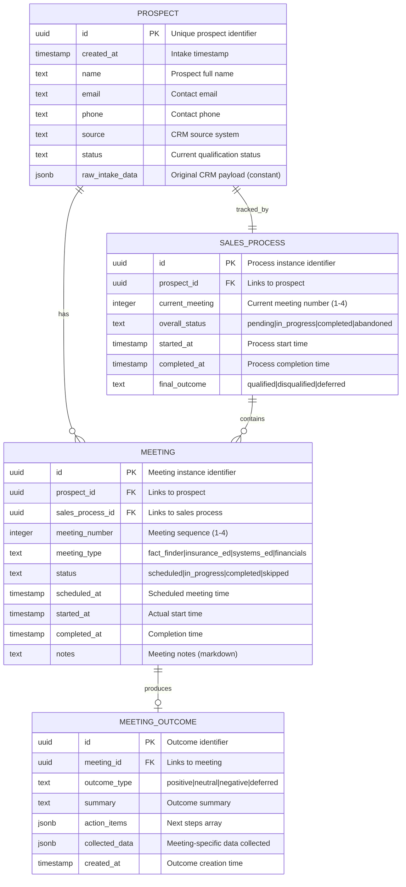

# ERD — Sales Navigator Hub

**Status**: ACTIVE
**Authority**: CONSTITUTION.md
**Version**: 1.0.0
**Hub**: HUB-SALES-NAV-20260130

---

## Derivation

This ERD is the **structural proof** of the transformation declared in the PRD:

> "This system transforms raw prospect intake data into qualified sales decisions and documented meeting outcomes."

Every table must trace to a declared constant and produce a declared variable.

---

## Entity Relationship Diagram



---

## Table Definitions

### 1. PROSPECT (CAPTURE Pass)

**Purpose**: Stores raw prospect data ingested from CRM.

| Column | Type | Nullable | Description |
|--------|------|----------|-------------|
| id | uuid | NO | Primary key |
| created_at | timestamp | NO | Intake timestamp |
| name | text | NO | Prospect full name |
| email | text | YES | Contact email |
| phone | text | YES | Contact phone |
| source | text | NO | CRM source identifier |
| status | text | NO | Qualification status |
| raw_intake_data | jsonb | NO | Original CRM payload (immutable constant) |

**Pressure Test**:
| Question | Answer |
|----------|--------|
| Q1: Constant dependency | `prospect_data` from CRM Intake Gateway |
| Q2: Variable output | `prospect_status` |
| Q3: Producing pass | CAPTURE (Ingress) |
| Q4: Lineage mechanism | `raw_intake_data` preserves original constant |

**Result**: PASS

---

### 2. SALES_PROCESS (COMPUTE Pass)

**Purpose**: Tracks the 4-meeting sales process for each prospect.

| Column | Type | Nullable | Description |
|--------|------|----------|-------------|
| id | uuid | NO | Primary key |
| prospect_id | uuid | NO | FK to prospect |
| current_meeting | integer | NO | Current meeting (1-4) |
| overall_status | text | NO | Process status |
| started_at | timestamp | NO | Process start |
| completed_at | timestamp | YES | Process completion |
| final_outcome | text | YES | Final decision |

**Pressure Test**:
| Question | Answer |
|----------|--------|
| Q1: Constant dependency | `prospect_data` via prospect table |
| Q2: Variable output | `prospect_status`, `sales_analytics` |
| Q3: Producing pass | COMPUTE (Middle) |
| Q4: Lineage mechanism | FK to prospect.id |

**Result**: PASS

---

### 3. MEETING (COMPUTE Pass)

**Purpose**: Individual meeting instances within the sales process.

| Column | Type | Nullable | Description |
|--------|------|----------|-------------|
| id | uuid | NO | Primary key |
| prospect_id | uuid | NO | FK to prospect |
| sales_process_id | uuid | NO | FK to sales_process |
| meeting_number | integer | NO | Sequence (1-4) |
| meeting_type | text | NO | Meeting type enum |
| status | text | NO | Meeting status |
| scheduled_at | timestamp | YES | Scheduled time |
| started_at | timestamp | YES | Actual start |
| completed_at | timestamp | YES | Completion time |
| notes | text | YES | Meeting notes |

**Pressure Test**:
| Question | Answer |
|----------|--------|
| Q1: Constant dependency | `meeting_templates`, `prospect_data` |
| Q2: Variable output | `meeting_outcomes` |
| Q3: Producing pass | COMPUTE (Middle) |
| Q4: Lineage mechanism | FK to prospect.id, sales_process.id |

**Result**: PASS

---

### 4. MEETING_OUTCOME (GOVERN Pass)

**Purpose**: Documented outcomes and action items from each meeting.

| Column | Type | Nullable | Description |
|--------|------|----------|-------------|
| id | uuid | NO | Primary key |
| meeting_id | uuid | NO | FK to meeting |
| outcome_type | text | NO | Outcome classification |
| summary | text | NO | Outcome summary |
| action_items | jsonb | YES | Next steps array |
| collected_data | jsonb | YES | Meeting-specific data |
| created_at | timestamp | NO | Creation timestamp |

**Pressure Test**:
| Question | Answer |
|----------|--------|
| Q1: Constant dependency | `meeting_templates`, `sales_rules` |
| Q2: Variable output | `meeting_outcomes`, `action_items` |
| Q3: Producing pass | GOVERN (Egress) |
| Q4: Lineage mechanism | FK to meeting.id |

**Result**: PASS

---

## Upstream Flow Test

### Flow: CRM → PROSPECT → SALES_PROCESS → MEETING → MEETING_OUTCOME

```
STEP 1: IDENTIFY UPSTREAM CONSTANT
        └─ Constant: prospect_data
        └─ Source: CRM Intake Gateway

STEP 2: INJECT SYNTHETIC DATA
        └─ Injection Point: CRM Intake Gateway spoke
        └─ Test Payload: { name: "Test Prospect", email: "test@example.com" }

STEP 3: TRAVERSE DECLARED PASSES
        └─ Pass 1 (CAPTURE): CRM → prospect table → Status: PASS
        └─ Pass 2 (COMPUTE): prospect → sales_process → meeting → Status: PASS
        └─ Pass 3 (GOVERN): meeting → meeting_outcome → Status: PASS

STEP 4: VERIFY ARRIVAL
        └─ Target Table: meeting_outcome
        └─ Data Arrived: YES
        └─ Lineage Intact: YES (FK chain preserved)

UPSTREAM FLOW TEST RESULT: PASS
```

---

## Pass-to-Table Mapping

| Pass | Tables Owned | Role |
|------|--------------|------|
| **CAPTURE** | prospect | Raw ingested data from CRM |
| **COMPUTE** | sales_process, meeting | Transformed/enriched data |
| **GOVERN** | meeting_outcome | Governed output data |

---

## Constant → Variable Traceability

| Constant (Input) | Table | Variable (Output) |
|------------------|-------|-------------------|
| prospect_data | prospect | prospect_status |
| meeting_templates | meeting | meeting_outcomes |
| sales_rules | meeting_outcome | action_items |
| integration_credentials | (runtime only) | N/A |

---

## Validation Summary

| # | Check | Status |
|---|-------|--------|
| 1 | All tables trace to PRD constants | PASS |
| 2 | All tables produce PRD variables | PASS |
| 3 | All tables have pass ownership | PASS |
| 4 | All tables have lineage mechanism | PASS |
| 5 | Upstream flow test passes | PASS |
| 6 | No orphan tables | PASS |
| 7 | No speculative tables | PASS |
| 8 | No convenience tables | PASS |

**ERD VALIDATION RESULT**: PASS

---

## Document Control

| Field | Value |
|-------|-------|
| Created | 2026-01-30 |
| Last Modified | 2026-01-30 |
| Version | 1.0.0 |
| Status | ACTIVE |
| Authority | CONSTITUTION.md |
| Hub | HUB-SALES-NAV-20260130 |
| Governing PRD | docs/PRD.md |
