# ERD — Sales Navigator Hub

**Status**: ACTIVE
**Authority**: CONSTITUTION.md
**Version**: 2.0.0
**Hub**: HUB-SALES-NAV-20260130
**OSAM**: docs/OSAM.md

---

## Derivation

This ERD is the **structural proof** of the transformation declared in the PRD:

> "This system transforms raw prospect intake data into qualified sales decisions and documented meeting outcomes."

Every table must trace to a declared constant and produce a declared variable. Every join must be declared in OSAM.

---

## Schema: `sales`

**Pattern**: 2 tables per sub-hub (canonical + append-only errors)
**Universal Join Key**: `sales_id TEXT`
**Spine**: `sales.sales_state`

---

## Entity Relationship Diagram

```mermaid
erDiagram
    SALES_STATE ||--o| SALES_FACTFINDER : "1:1 via sales_id"
    SALES_STATE ||--o| SALES_INSURANCE : "1:1 via sales_id"
    SALES_STATE ||--o| SALES_SYSTEMS : "1:1 via sales_id"
    SALES_STATE ||--o| SALES_QUOTES : "1:1 via sales_id"
    SALES_STATE ||--o{ SALES_FACTFINDER_ERRORS : "1:N via sales_id"
    SALES_STATE ||--o{ SALES_INSURANCE_ERRORS : "1:N via sales_id"
    SALES_STATE ||--o{ SALES_SYSTEMS_ERRORS : "1:N via sales_id"
    SALES_STATE ||--o{ SALES_QUOTES_ERRORS : "1:N via sales_id"

    SALES_STATE {
        text sales_id PK "Universal join key"
        text current_phase "Active sub-hub gate"
        timestamp created_at "Process inception"
        timestamp updated_at "Last phase transition"
    }

    SALES_FACTFINDER {
        text sales_id PK "Join anchor"
        text employer_name "Company name"
        int employee_count "Total employees"
        int renewal_month "Benefits renewal month"
        text prior_broker "Previous broker"
        timestamp created_at "Record creation"
        timestamp updated_at "Last update"
    }

    SALES_FACTFINDER_ERRORS {
        bigserial id PK "Auto-increment"
        text sales_id "Links to canonical"
        text error_code "Machine-readable error"
        jsonb payload "Full error context"
        text process_id "Originating process"
        timestamp created_at "Append timestamp"
    }

    SALES_INSURANCE {
        text sales_id PK "Join anchor"
        text funding_model "Insurance funding model"
        text strategy_selected "Selected strategy"
        timestamp created_at "Record creation"
        timestamp updated_at "Last update"
    }

    SALES_INSURANCE_ERRORS {
        bigserial id PK "Auto-increment"
        text sales_id "Links to canonical"
        text error_code "Machine-readable error"
        jsonb payload "Full error context"
        text process_id "Originating process"
        timestamp created_at "Append timestamp"
    }

    SALES_SYSTEMS {
        text sales_id PK "Join anchor"
        text payroll_system "Payroll provider"
        text admin_model "Administration model"
        text compliance_owner "Compliance responsible party"
        timestamp created_at "Record creation"
        timestamp updated_at "Last update"
    }

    SALES_SYSTEMS_ERRORS {
        bigserial id PK "Auto-increment"
        text sales_id "Links to canonical"
        text error_code "Machine-readable error"
        jsonb payload "Full error context"
        text process_id "Originating process"
        timestamp created_at "Append timestamp"
    }

    SALES_QUOTES {
        text sales_id PK "Join anchor"
        int quote_version "Quote iteration number"
        numeric total_cost "Total quoted cost"
        boolean approved_flag "Approval status"
        timestamp created_at "Record creation"
        timestamp updated_at "Last update"
    }

    SALES_QUOTES_ERRORS {
        bigserial id PK "Auto-increment"
        text sales_id "Links to canonical"
        text error_code "Machine-readable error"
        jsonb payload "Full error context"
        text process_id "Originating process"
        timestamp created_at "Append timestamp"
    }
```



---

## Table Definitions

### 1. SALES_STATE (Spine — Phase Router)

**Purpose**: Authoritative source of sales process identity. Gates sub-hub access via `current_phase`.

| Column | Type | Nullable | Description |
|--------|------|----------|-------------|
| sales_id | TEXT | NO | Primary key — universal join key |
| current_phase | TEXT | NO | Active phase (factfinder, insurance, systems, quotes) |
| created_at | TIMESTAMP | NO | Process inception |
| updated_at | TIMESTAMP | NO | Last phase transition |

**OSAM Classification**: QUERY (query surface = YES)

**Pressure Test**:

| Question | Answer |
|----------|--------|
| Q1: Constant dependency | `prospect_data` — sales_id minted at intake |
| Q2: Variable output | `current_phase` |
| Q3: Producing pass | CAPTURE (Ingress) |
| Q4: Lineage mechanism | `sales_id` is the universal join key propagated to all sub-hubs |

**Result**: PASS

---

### 2. SALES_FACTFINDER (Meeting 1 — Canonical)

**Purpose**: Stores employer data captured during the Fact Finder meeting.

| Column | Type | Nullable | Description |
|--------|------|----------|-------------|
| sales_id | TEXT | NO | Primary key — join anchor |
| employer_name | TEXT | YES | Company name |
| employee_count | INT | YES | Total employees |
| renewal_month | INT | YES | Benefits renewal month |
| prior_broker | TEXT | YES | Previous broker name |
| created_at | TIMESTAMP | YES | Record creation |
| updated_at | TIMESTAMP | YES | Last update |

**OSAM Classification**: QUERY (query surface = YES)

**Pressure Test**:

| Question | Answer |
|----------|--------|
| Q1: Constant dependency | `prospect_data` via CRM intake |
| Q2: Variable output | `factfinder_data` (employer_name, employee_count, renewal_month, prior_broker) |
| Q3: Producing pass | COMPUTE (Middle) |
| Q4: Lineage mechanism | PK `sales_id` joins to spine |

**Result**: PASS

---

### 3. SALES_FACTFINDER_ERRORS (Meeting 1 — Errors)

**Purpose**: Append-only error log for FactFinder sub-hub.

| Column | Type | Nullable | Description |
|--------|------|----------|-------------|
| id | BIGSERIAL | NO | Auto-increment PK |
| sales_id | TEXT | YES | Links to canonical row |
| error_code | TEXT | YES | Machine-readable error identifier |
| payload | JSONB | YES | Full error context |
| process_id | TEXT | YES | Originating process/agent |
| created_at | TIMESTAMP | YES | Append timestamp |

**OSAM Classification**: AUDIT (query surface = NO)
**Mutability**: INSERT only. No updates. No deletes.

**Result**: PASS (error table contract compliant)

---

### 4. SALES_INSURANCE (Meeting 2 — Canonical)

**Purpose**: Stores insurance education outcomes and funding model selection.

| Column | Type | Nullable | Description |
|--------|------|----------|-------------|
| sales_id | TEXT | NO | Primary key — join anchor |
| funding_model | TEXT | YES | Insurance funding model |
| strategy_selected | TEXT | YES | Selected strategy |
| created_at | TIMESTAMP | YES | Record creation |
| updated_at | TIMESTAMP | YES | Last update |

**OSAM Classification**: QUERY (query surface = YES)

**Pressure Test**:

| Question | Answer |
|----------|--------|
| Q1: Constant dependency | `factfinder_data` from Meeting 1 |
| Q2: Variable output | `insurance_data` (funding_model, strategy_selected) |
| Q3: Producing pass | COMPUTE (Middle) |
| Q4: Lineage mechanism | PK `sales_id` joins to spine |

**Result**: PASS

---

### 5. SALES_INSURANCE_ERRORS (Meeting 2 — Errors)

**Purpose**: Append-only error log for Insurance sub-hub.

| Column | Type | Nullable | Description |
|--------|------|----------|-------------|
| id | BIGSERIAL | NO | Auto-increment PK |
| sales_id | TEXT | YES | Links to canonical row |
| error_code | TEXT | YES | Machine-readable error identifier |
| payload | JSONB | YES | Full error context |
| process_id | TEXT | YES | Originating process/agent |
| created_at | TIMESTAMP | YES | Append timestamp |

**OSAM Classification**: AUDIT (query surface = NO)
**Mutability**: INSERT only.

**Result**: PASS

---

### 6. SALES_SYSTEMS (Meeting 3 — Canonical)

**Purpose**: Stores systems/operations assessment outcomes.

| Column | Type | Nullable | Description |
|--------|------|----------|-------------|
| sales_id | TEXT | NO | Primary key — join anchor |
| payroll_system | TEXT | YES | Payroll provider |
| admin_model | TEXT | YES | Administration model |
| compliance_owner | TEXT | YES | Compliance responsible party |
| created_at | TIMESTAMP | YES | Record creation |
| updated_at | TIMESTAMP | YES | Last update |

**OSAM Classification**: QUERY (query surface = YES)

**Pressure Test**:

| Question | Answer |
|----------|--------|
| Q1: Constant dependency | `insurance_data` from Meeting 2 |
| Q2: Variable output | `systems_data` (payroll_system, admin_model, compliance_owner) |
| Q3: Producing pass | COMPUTE (Middle) |
| Q4: Lineage mechanism | PK `sales_id` joins to spine |

**Result**: PASS

---

### 7. SALES_SYSTEMS_ERRORS (Meeting 3 — Errors)

**Purpose**: Append-only error log for Systems sub-hub.

| Column | Type | Nullable | Description |
|--------|------|----------|-------------|
| id | BIGSERIAL | NO | Auto-increment PK |
| sales_id | TEXT | YES | Links to canonical row |
| error_code | TEXT | YES | Machine-readable error identifier |
| payload | JSONB | YES | Full error context |
| process_id | TEXT | YES | Originating process/agent |
| created_at | TIMESTAMP | YES | Append timestamp |

**OSAM Classification**: AUDIT (query surface = NO)
**Mutability**: INSERT only.

**Result**: PASS

---

### 8. SALES_QUOTES (Meeting 4 — Canonical)

**Purpose**: Stores financial quotes and approval status. Triggers `PROMOTE_TO_CLIENT` on approval.

| Column | Type | Nullable | Description |
|--------|------|----------|-------------|
| sales_id | TEXT | NO | Primary key — join anchor |
| quote_version | INT | YES | Quote iteration number |
| total_cost | NUMERIC | YES | Total quoted cost |
| approved_flag | BOOLEAN | YES | Approval status (triggers promotion) |
| created_at | TIMESTAMP | YES | Record creation |
| updated_at | TIMESTAMP | YES | Last update |

**OSAM Classification**: QUERY (query surface = YES)

**Pressure Test**:

| Question | Answer |
|----------|--------|
| Q1: Constant dependency | All prior meeting outputs (factfinder, insurance, systems) |
| Q2: Variable output | `quote_data` (quote_version, total_cost, approved_flag) |
| Q3: Producing pass | COMPUTE → GOVERN (Middle → Egress) |
| Q4: Lineage mechanism | PK `sales_id` joins to spine |

**Result**: PASS

**Promotion**: When `approved_flag = true`, the `PROMOTE_TO_CLIENT` event fires per `sales/contracts/promote_to_client.json`.

---

### 9. SALES_QUOTES_ERRORS (Meeting 4 — Errors)

**Purpose**: Append-only error log for Quotes sub-hub.

| Column | Type | Nullable | Description |
|--------|------|----------|-------------|
| id | BIGSERIAL | NO | Auto-increment PK |
| sales_id | TEXT | YES | Links to canonical row |
| error_code | TEXT | YES | Machine-readable error identifier |
| payload | JSONB | YES | Full error context |
| process_id | TEXT | YES | Originating process/agent |
| created_at | TIMESTAMP | YES | Append timestamp |

**OSAM Classification**: AUDIT (query surface = NO)
**Mutability**: INSERT only.

**Result**: PASS

---

## Upstream Flow Test

### Flow: CRM → SALES_STATE → FACTFINDER → INSURANCE → SYSTEMS → QUOTES → PROMOTE

```
STEP 1: IDENTIFY UPSTREAM CONSTANT
        └─ Constant: prospect_data
        └─ Source: CRM Intake Gateway

STEP 2: MINT sales_id IN SPINE
        └─ Table: sales.sales_state
        └─ Phase: factfinder
        └─ Result: PASS (sales_id minted)

STEP 3: TRAVERSE DECLARED PASSES
        └─ Pass 1 (CAPTURE):  CRM → sales_state                → Status: PASS
        └─ Pass 2 (COMPUTE):  sales_state → sales_factfinder    → Status: PASS
        └─ Pass 3 (COMPUTE):  sales_state → sales_insurance     → Status: PASS
        └─ Pass 4 (COMPUTE):  sales_state → sales_systems       → Status: PASS
        └─ Pass 5 (GOVERN):   sales_state → sales_quotes        → Status: PASS

STEP 4: VERIFY ARRIVAL
        └─ Target Table: sales.sales_quotes
        └─ Data Arrived: YES
        └─ Lineage Intact: YES (sales_id chain preserved)
        └─ Promotion Ready: YES (approved_flag available)

UPSTREAM FLOW TEST RESULT: PASS
```

---

## Pass-to-Table Mapping

| Pass | Tables Owned | Role |
|------|--------------|------|
| **CAPTURE** | sales_state | Spine — mints sales_id, sets initial phase |
| **COMPUTE** | sales_factfinder, sales_insurance, sales_systems, sales_quotes | Sub-hub canonical data |
| **GOVERN** | sales_quotes (approved_flag) | Triggers PROMOTE_TO_CLIENT egress event |
| **AUDIT** | all *_errors tables | Append-only error logs |

---

## Constant → Variable Traceability

| Constant (Input) | Table | Variable (Output) |
|------------------|-------|-------------------|
| prospect_data | sales_state | current_phase |
| prospect_data | sales_factfinder | employer_name, employee_count, renewal_month, prior_broker |
| factfinder_data | sales_insurance | funding_model, strategy_selected |
| insurance_data | sales_systems | payroll_system, admin_model, compliance_owner |
| all prior outputs | sales_quotes | quote_version, total_cost, approved_flag |
| (process errors) | *_errors | error_code, payload (append-only) |

---

## OSAM Join Compliance

All joins declared in this ERD match OSAM exactly:

| ERD Join | OSAM Declared | Status |
|----------|---------------|--------|
| sales_state → sales_factfinder | YES | COMPLIANT |
| sales_state → sales_factfinder_errors | YES | COMPLIANT |
| sales_state → sales_insurance | YES | COMPLIANT |
| sales_state → sales_insurance_errors | YES | COMPLIANT |
| sales_state → sales_systems | YES | COMPLIANT |
| sales_state → sales_systems_errors | YES | COMPLIANT |
| sales_state → sales_quotes | YES | COMPLIANT |
| sales_state → sales_quotes_errors | YES | COMPLIANT |

**Cross-sub-hub joins**: NONE (compliant with OSAM isolation rule)
**Undeclared joins**: NONE

---

## Validation Summary

| # | Check | Status |
|---|-------|--------|
| 1 | All tables trace to PRD constants | PASS |
| 2 | All tables produce PRD variables | PASS |
| 3 | All tables have pass ownership | PASS |
| 4 | All tables have lineage mechanism (sales_id) | PASS |
| 5 | Upstream flow test passes | PASS |
| 6 | No orphan tables | PASS |
| 7 | No speculative tables | PASS |
| 8 | No convenience tables | PASS |
| 9 | All joins declared in OSAM | PASS |
| 10 | No cross-sub-hub direct joins | PASS |
| 11 | Error tables are append-only | PASS |
| 12 | Universal join key consistent (sales_id TEXT) | PASS |

**ERD VALIDATION RESULT**: PASS

---

## Document Control

| Field | Value |
|-------|-------|
| Created | 2026-01-30 |
| Last Modified | 2026-02-11 |
| Version | 2.0.0 |
| Status | ACTIVE |
| Authority | CONSTITUTION.md |
| Hub | HUB-SALES-NAV-20260130 |
| Governing PRD | docs/PRD.md |
| Governing OSAM | docs/OSAM.md |
| Schema DDL | sales/migrations/001_sales_schema.sql |
