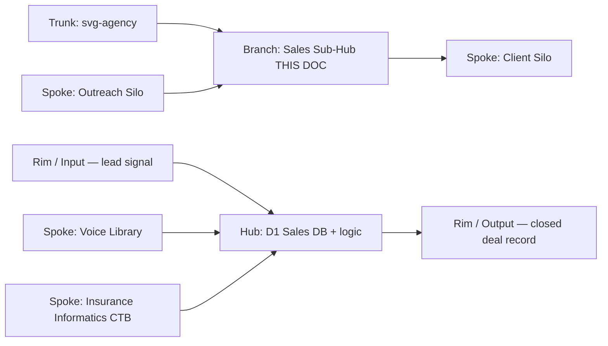
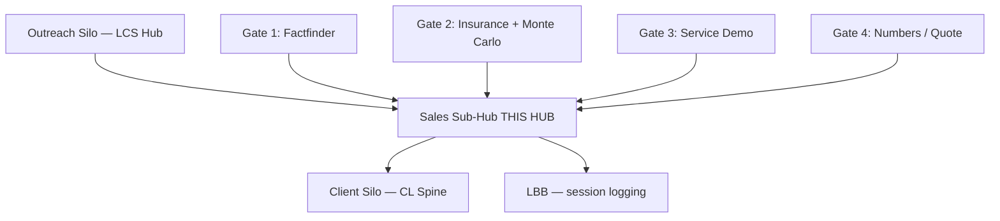

# Sales Sub-Hub
## The hub that runs the entire svg-agency sales process — four-gate qualification from prospect to closed, all logic owned here, nothing leaks to the spokes.
### Status: BUILD
### Medium: database + worker (sub-hub)
### Business: svg-agency

---

## UT Checklist (Pre-Flight)

_Every UT doc MUST carry this block at the top. Check a box when the referenced section is filled. This is a pre-flight checklist, not bureaucracy. A pilot does not take off without documentation in the cockpit, a flight plan filed, and a pre-flight walkaround logged. A doc does not ship (ORBT=OPERATE) without all 12 items checked. Unchecked = grounded._

_Aviation Model mapping:_
- _Items 1–11 = the doc's airworthiness certificate + POH (operating handbook)_
- _Item 12 (Live Verification) = the pre-flight walkaround — every gauge confirmed against reality, not memory_
- _§14 Maintenance Logbook = the aircraft logbook you keep in the cockpit — every touch recorded, signed, timestamped_

| # | Check | Status | Location |
|---|-------|--------|----------|
| 1 | PRD — what / why / who / scope / out-of-scope / success metric | ☑ | §2 |
| 2 | OSAM — READ / WRITE / Join Chain / Forbidden Paths / Query Routing filled | ☑ | §5 |
| 3 | Component Status — every dependency has green/yellow/red with 1-line state | ☑ | §3 |
| 4 | Owner — human who fixes this at 2 AM | ☑ | §1 |
| 5 | Live Dashboard — URL or explicit "N/A" | ☑ | §3 |
| 6 | Kill Switch — exact command to stop the process | ☑ | §8 |
| 7 | Logbook — last audit verdict + date (after certification only) | ☐ | §12 |
| 8 | FCEs Attached — which FCE runs structurally back this doc | ☑ | §3c |
| 9 | BARs Referenced — every BAR this doc touches, with status | ☑ | §3d |
| 10 | LBB Subjects Fed — which LBB subject(s) this doc's session logs go to | ☑ | §3e |
| 11 | Geometry — CTB position + Hub-Spoke role + Altitude | ☑ | §1b |
| 12 | Live Verification — every numeric count, cron, URL, command, BAR status grounded against the actual system | ☐ | §9b |

---

# IDENTITY (Thing — what this IS)

_Everything in this cluster answers: what exists? These are constants that don't change regardless of who reads this or when._

## 1. IDENTITY

| Field | Value |
|-------|-------|
| ID | DB-SALES / sales-sub-hub |
| Name | Sales Sub-Hub |
| Medium | database + worker (sub-hub) |
| Business Silo | svg-agency |
| CTB Position | branch — trunk: svg-agency / branch: sales |
| ORBT | BUILD |
| Strikes | 0 |
| Authority | inherited from svg-agency trunk (CC-01) |
| Last Modified | 2026-04-16 |
| BAR Reference | BAR-48 (content taxonomy), BAR-194 (sales presentation engine) |
| Owner | Dave Barton |

### 1b. Geometry (Checklist item 11)

**CTB Position:** `trunk → svg-agency → sales` (branch level — tactical through execution, 30k-5k)

**Hub-Spoke Role:** Hub. ALL sales process logic lives here. Spokes are the outreach system (feeding leads in) and the client silo (receiving closed accounts). No logic in the spokes — they carry only. The D1 database is the hub's retained state. Any future sales worker exposes the hub's logic via a rim (I/O boundary with schema validation).

**Altitude:** 30k tactical (gate selection, deal stage routing) down to 5k execution (quote approval, specific numbers, specific contacts).



_This doc IS the hub. All sales state lives in svg-d1-sales. Spokes feed it; they own no decisions._

### HEIR (8 fields)

| Field | Value |
|-------|-------|
| sovereign_ref | imo-creator |
| hub_id | DB-SALES |
| ctb_placement | branch |
| imo_topology | middle (hub owns all transformation; input = lead signal; output = closed deal or disqualified) |
| cc_layer | CC-03 (context layer — sub-hub of svg-agency trunk) |
| services | Cloudflare D1 (svg-d1-sales, ID: 95835f64-db7f-43d4-b211-899b11a17c96), Doppler (secrets), LBB (session logging) |
| secrets_provider | Doppler — project: imo-creator, config: dev |
| acceptance_criteria | All four gate tables populated for a given sales_id with no errors; sales_state.current_phase advances sequentially; approved_flag=1 on sales_quotes before close |

---

## 2. PURPOSE (PRD)

_What breaks without it. What business outcome it serves._

### WHAT

The Sales Sub-Hub is the stateful engine for every svg-agency sales engagement. It holds every prospect's journey through the four-gate qualification process — factfinder, insurance education, systems/service demo, and numbers/quote — and is the single source of truth for where each deal stands. Nothing moves without this hub knowing about it.

### WHY

Without this hub, the sales process has no state. Gates collapse into each other, deals fall out of sequence, and Dave has no data on which prospects are at which gate or why they stalled. The hub is what turns Dave's four-gate IP into a repeatable, measurable process instead of a series of conversations that live in his head.

### WHO

- **Dave Barton** — primary operator; reads gate status, pushes deals forward, reviews quote data
- **Sales presentation engine** (BAR-194) — writes gate data as meetings are completed
- **LCS Hub** — upstream feeder; provides the lead signal that opens a new sales_state record
- **Client silo** — downstream consumer; reads closed_won records to initialize client onboarding

### SCOPE (in)

- All four gates of the sales process (factfinder, insurance/Monte Carlo, service demo, quote)
- Prospect state tracking from first signal to closed_won or closed_lost
- Contact management for all decision-makers at a prospect company
- Interaction logging (emails, calls, meetings, notes) tied to gate number
- Quote versioning and approval tracking
- Error capture for every gate table (CQRS pattern — one canonical + one error table per gate)
- Insurance data (funding model, strategy) captured at gate 2
- Systems data (payroll, admin model, compliance owner) captured at gate 3

### OUT-OF-SCOPE

- **Outreach/prospecting upstream of gate 1** — owned by the outreach silo (svg-d1-outreach-ops, LCS Hub)
- **Client onboarding post-close** — owned by the client silo (CL spine)
- **Content delivery (gate videos, PDFs)** — owned by BAR-194 / the sales presentation engine
- **Voice library content** — owned by `law/VOICE-LIBRARY.md` and `lcs_voice_library` table in spine D1
- **Insurance Informatics content architecture** — owned by `fleet/content/INSURANCE-INFORMATICS-CTB.md`
- **Financial modeling / Monte Carlo computation** — [PENDING — needs Dave input on which system runs the Monte Carlo math and where output is stored]

### SUCCESS METRIC

Gate advancement rate: percentage of prospects who advance from gate N to gate N+1 within 30 days of gate N completion. Target and tolerance [PENDING — needs Dave input on expected conversion rates per gate].

---

## 3. RESOURCES

_Everything this depends on. A mechanic reads this and knows exactly what to set up before it can run._

### Component Status Grid (Checklist item 3)

| Component | HEIR (`hub_id · ctb · cc_layer`) | ORBT | Light | State |
|-----------|----------------------------------|------|-------|-------|
| svg-d1-sales (D1 database) | DB-SALES · branch · CC-03 | BUILD | 🟢 | Schema deployed, 11 tables live, 0 rows (no deals yet) |
| LCS Hub (signal source) | lcs-hub · branch · CC-03 | OPERATE | 🟢 | Live at lcs-hub.svg-outreach.workers.dev, feeds leads to outreach silo |
| CL spine (client identity) | cl-spine · trunk · CC-02 | OPERATE | 🟢 | cl_company_identity live in svg-d1-spine; sovereign_id FK available |
| Outreach silo (lead source) | DB-OUTREACH · branch · CC-03 | OPERATE | 🟢 | outreach_company_target has 32,702 companies |
| Voice Library (scripts) | VOICE-LIB · leaf · CC-04 | BUILD | 🟡 | VOICE-LIBRARY.md exists; lcs_voice_library table seeded in spine D1 (BAR-285) |
| Insurance Informatics CTB | INS-CTB · branch · CC-03 | BUILD | 🟡 | Document live at fleet/content/INSURANCE-INFORMATICS-CTB.md; content not yet fully compiled into gate videos |
| Sales presentation engine | BAR-194 · leaf · CC-04 | BUILD | 🔴 | BAR-194 open; gate video generation not yet built |
| Doppler (secrets) | doppler · trunk · CC-01 | OPERATE | 🟢 | Project imo-creator, config dev, all keys accessible |
| LBB (session logging) | lbb · branch · CC-03 | OPERATE | 🟢 | lbb.svg-outreach.workers.dev live; svg-sales subject available |

### Live Dashboard (Checklist item 5)

| Resource | URL | What it shows |
|----------|-----|---------------|
| IMO Dashboard | https://imo-dashboard.pages.dev | Hub-spoke layout; sales sub-hub visible as branch node |
| D1 Sales DB (direct) | N/A — D1 only via wrangler CLI or bound worker | Table counts, row data |
| LCS Hub health | https://lcs-hub.svg-outreach.workers.dev/health | Worker up/down, last signal processed |

### Dependencies

| Dependency | Type | What It Provides | Status |
|-----------|------|-----------------|--------|
| svg-d1-sales (95835f64) | D1 database | All sales state storage | DONE |
| svg-d1-spine (641a9a1e) | D1 database | cl_company_identity (sovereign_id FK), lcs_voice_library | DONE |
| svg-d1-outreach-ops (73a285b8) | D1 database | outreach_company_target (lead source, company context) | DONE |
| LCS Hub compiler | Cloudflare Worker | Generates lead signals that trigger new sales_state records | DONE |
| Insurance Informatics CTB | Document | Content architecture for all four gate educations | DONE (doc) |
| Voice Library | Document + D1 table | Scripts for gate 1-4 videos and emails | DONE (doc), DONE (table) |
| Sales presentation engine | Worker (BAR-194) | Renders gate videos, writes gate completion events | PENDING — BAR-194 |
| Monte Carlo model | [PENDING — needs Dave input] | Computes two-path insurance divergence for gate 2 | PENDING |

### Downstream Consumers

| Consumer | What It Needs |
|----------|--------------|
| Client silo (CL spine) | sales_state.sovereign_id when current_phase = closed_won, to initiate onboarding |
| IMO Dashboard | sales_state counts by phase for pipeline view |
| LBB | Session summaries ingested per deal milestone (subject: svg-sales) |
| [PENDING — reporting layer] | Quote data, gate timing, conversion rates for pipeline analytics |

### Tools & Integrations (if applicable)

| Item | Type | Cost Tier | Credentials | What It Does |
|------|------|-----------|-------------|-------------|
| Cloudflare D1 | Database | Free (within Workers plan) | CF_API_TOKEN in Doppler | Hosts svg-d1-sales |
| Doppler | Secrets manager | Cheap | Native | Stores all env vars and API keys |
| LBB Worker | Knowledge store | Free (internal) | LBB_API_KEY in Doppler | Logs session learnings per deal |
| [PENDING — Monte Carlo] | [PENDING] | [PENDING] | [PENDING] | Runs gate 2 simulation |

### Secrets (if applicable)

| Secret | Doppler Project | Config | Used By |
|--------|----------------|--------|---------|
| LBB_API_KEY | imo-creator | dev | LBB session ingest after each gate completion |
| CF_API_TOKEN / GLOBAL_CLOUDFLARE_API_TOKEN | imo-creator | dev | D1 access via wrangler |
| [PENDING — sales worker secrets] | imo-creator | dev | Future sales worker binding to D1 |

### 3c. FCEs Attached (Checklist item 8)

| FCE Name | HEIR (`hub_id · ctb · cc_layer`) | ORBT | Run Directory | Latest P=1 | Rows | Status |
|----------|----------------------------------|------|--------------|------------|------|--------|
| FCE-008 SVG Outreach | fce-008 · branch · CC-03 | OPERATE | factory/agents/up/dyno-runs/ | 2026-04-15 | 34 trunk constants | 🟢 |
| [PENDING — FCE-SALES] | [TBD] | BUILD | [TBD] | pending | 0 | 🔴 |

_A dedicated FCE for the sales sub-hub has not yet been run. The outreach FCE covers lead identification upstream; a sales-specific FCE is needed to validate the gate process constants._

### 3d. BARs Referenced (Checklist item 9)

| BAR | Title | HEIR (`bar-id · ctb · cc_layer`) | ORBT | Status | Relation |
|-----|-------|----------------------------------|------|--------|----------|
| BAR-48 | Content taxonomy | bar-48 · branch · CC-04 | [PENDING — verify in Linear] | [PENDING] | implements — content structure for gate education materials |
| BAR-194 | Sales presentation engine | bar-194 · branch · CC-03 | BUILD | [PENDING — verify in Linear] | implements — gate video generation and delivery |
| BAR-285 | Voice library (lcs_voice_library) | bar-285 · leaf · CC-04 | OPERATE | closed | dependency — voice constants used in gate scripts |

### 3e. LBB Subjects Fed (Checklist item 10)

| LBB Subject | HEIR (`subject-id · ctb · cc_layer`) | ORBT | What This Doc Writes | Frequency |
|-------------|--------------------------------------|------|---------------------|-----------|
| svg-sales | svg-sales · branch · CC-03 | BUILD | Session summaries, gate completion events, deal learnings | per session / per gate |
| svg-sales-process | svg-sales-process · leaf · CC-04 | BUILD | Process corrections, gate timing data, conversion observations | on-change |
| svg-sales-pipeline | svg-sales-pipeline · leaf · CC-04 | BUILD | Pipeline state snapshots, stage distribution | daily when active |

---

# CONTRACT (Flow — what flows through this)

_Everything in this cluster answers: what moves? How does data/work enter, get processed, and exit?_

## 4. IMO — Input, Middle, Output

### Two-Question Intake

1. **"What triggers this?"** — A qualified lead signal arrives from the outreach silo (LCS Hub marks a company as a sales-ready prospect), OR Dave manually opens a new deal for a company already in the outreach database.
2. **"How do we get it?"** — Lead signal carries a `sovereign_company_id` that maps to `cl_company_identity.sovereign_id` and links to `outreach_company_target` for company context. Dave or the sales engine writes a new `sales_state` record to open the engagement.

### Input

A qualifying signal — either automated (LCS Hub pipeline promoting a company to sales-ready) or manual (Dave deciding to open a deal) — with a `sovereign_company_id` as the key. Company context (name, domain, employee count, DOL data, carrier, broker, renewal month) flows in from the outreach silo via the sovereign_id FK. The trigger for each gate is Dave completing a meeting and marking the gate done, which writes gate-specific data to the appropriate table.

### Middle

The four-gate process. Each gate has a canonical table and an error table. State machine is `sales_state.current_phase` — it advances only when the prior gate's canonical table is fully populated with no open errors.

| Step | Input | What Happens | Output | Tool Used |
|------|-------|-------------|--------|-----------|
| 0: Deal Open | sovereign_company_id + company name | New row in sales_state (phase=factfinder) | sales_id created | D1 write |
| 1: Factfinder (Gate 1) | sales_id + meeting outcome | sales_factfinder populated (employer, employee count, renewal month, prior broker) | Gate 1 complete; phase advances to insurance | D1 write; Gate 1 video rendered by BAR-194 |
| 2: Insurance/Monte Carlo (Gate 2) | sales_id + client's current bill | sales_insurance populated (funding model, strategy selected); Monte Carlo run | Gate 2 complete; phase advances to systems | [PENDING — Monte Carlo system]; D1 write |
| 3: Service Demo (Gate 3) | sales_id + meeting outcome | sales_systems populated (payroll_system, admin_model, compliance_owner) | Gate 3 complete; phase advances to quotes | D1 write; Gate 3 video rendered by BAR-194 |
| 4: Numbers/Quote (Gate 4) | sales_id + quote data | sales_quotes populated (quote_version, total_cost, approved_flag) | Gate 4 complete; deal closes or goes stale | D1 write; Gate 4 video rendered by BAR-194 |
| 5: Close | sales_id + approved_flag=1 (or loss reason) | sales_state.current_phase = closed_won or closed_lost | Downstream signal to client silo | D1 write |
| ERR: Any gate | Any gate write failure | Error row in gate_errors table | Error record for triage | D1 write to error table |

Contacts and interactions are written throughout — every call, email, meeting is logged in `sales_contacts` and `sales_interactions` with `meeting_number` (1-4) mapping to the gate.

### Output

For `closed_won`: a complete `sales_id` record with all four gate tables populated, an approved quote, and a known `sovereign_id` ready to hand to the client silo for onboarding.

For `closed_lost`: a complete record of where the deal died and why, for backpropagation into the outreach FCE.

For in-progress deals: the current phase and a timestamp trail of every interaction, error, and gate transition.

### Circle (Bedrock §5)

Closed_lost deals feed back into the outreach silo as updated targeting data — which signals, which gate scripts, which company profiles stall and at what gate. This is the learning loop. Gate 2 conversion (did they show up with the bill?) measures education effectiveness. Gate 4 conversion (did they sign?) measures pricing and competitive positioning. Both feed back to the outreach signal registry and voice library. Without this loop, the sales process is open — same mistakes repeat.

---

## 5. OSAM — DATA SCHEMA (Where the Data Lives)

_The plumbing. Which tables this reads, writes, joins._

### READ Access

| Source | What It Provides | Join Key |
|--------|-----------------|----------|
| sales_state | Master deal record, current phase, status, bit_score | sales_id (PK) |
| sales_factfinder | Gate 1 data — employer, employee count, renewal month, prior broker | sales_id (FK → sales_state) |
| sales_insurance | Gate 2 data — funding model, strategy selected | sales_id (FK → sales_state) |
| sales_systems | Gate 3 data — payroll system, admin model, compliance owner | sales_id (FK → sales_state) |
| sales_quotes | Gate 4 data — quote version, total cost, approval flag | sales_id (FK → sales_state) |
| sales_contacts | All contacts per deal, decision-maker flag | contact_id (PK), sales_id (FK) |
| sales_interactions | Full interaction log per deal and contact | interaction_id (PK), sales_id (FK), contact_id (FK) |
| cl_company_identity (spine D1) | Canonical company name, domain, sovereign_id, outreach_id | sovereign_id (on sales_state) |
| outreach_company_target (outreach D1) | Employee count, postal code, carrier, DOL context | outreach_id (via cl_company_identity) |

### WRITE Access

| Target | What It Writes | When |
|--------|---------------|------|
| sales_state | current_phase advance, status change, bit_score | Every gate completion; close event |
| sales_factfinder | employer_name, employee_count, renewal_month, prior_broker | Gate 1 meeting complete |
| sales_factfinder_errors | error_code, payload, process_id | Any Gate 1 write failure |
| sales_insurance | funding_model, strategy_selected | Gate 2 meeting complete |
| sales_insurance_errors | error_code, payload, process_id | Any Gate 2 write failure |
| sales_systems | payroll_system, admin_model, compliance_owner | Gate 3 meeting complete |
| sales_systems_errors | error_code, payload, process_id | Any Gate 3 write failure |
| sales_quotes | quote_version, total_cost, approved_flag | Gate 4 meeting; quote approval |
| sales_quotes_errors | error_code, payload, process_id | Any Gate 4 write failure |
| sales_contacts | full_name, email, phone, role, is_decision_maker | Any new contact identified |
| sales_interactions | interaction_type, subject, body_snippet, direction, meeting_number, outcome | Every touchpoint |

### Process Composition



| Process ID | Name | Role in Composition | Status |
|-----------|------|---------------------|--------|
| — | Outreach Silo / LCS Hub | Upstream feeder — generates the lead signal | 🟢 OPERATE |
| Gate 1 | Factfinder | Sub-process 1 of 4 — establishes company facts, secures bill | 🟡 BUILD (schema ready, no runner) |
| Gate 2 | Insurance Education + Monte Carlo | Sub-process 2 of 4 — educates, runs simulation, selects strategy | 🔴 BUILD (Monte Carlo system pending) |
| Gate 3 | Service Demo | Sub-process 3 of 4 — shows dashboards, implementation, locks in operations | 🟡 BUILD (schema ready, no runner) |
| Gate 4 | Numbers / Quote | Sub-process 4 of 4 — presents specific quote, handles competitive objection | 🟡 BUILD (schema ready, no runner) |
| — | Client Silo / CL Spine | Downstream consumer — receives closed_won signal | 🟢 OPERATE |

### Join Chain

```
sales_state (sales_id — spine of all sales data)
  → sales_factfinder (sales_id, 1:1 — Gate 1 data)
  → sales_insurance (sales_id, 1:1 — Gate 2 data)
  → sales_systems (sales_id, 1:1 — Gate 3 data)
  → sales_quotes (sales_id, 1:1 — Gate 4 data)
  → sales_contacts (sales_id, 1:many — all contacts)
    → sales_interactions (sales_id + contact_id, 1:many — full touchpoint log)
  → sales_state.sovereign_id → cl_company_identity.sovereign_id (spine D1)
    → cl_company_identity.outreach_id → outreach_company_target.outreach_id (outreach D1)
```

### Forbidden Paths

| Action | Why |
|--------|-----|
| Writing gate N+1 data before gate N table is populated | Violates sequential gate dependency — the education builds on itself; you cannot show gate 2 math without gate 1 facts |
| Reading sales data from Neon vault | Neon is vault only; all working data lives in D1 (SEED → WORK → PUSH lifecycle) |
| Storing commission, broker fee, or carrier pricing in sales_quotes without Dave's approval | sales_quotes.approved_flag must be 1 before any downstream record is created — human gate required |
| Cross-silo writes from outreach tables directly to sales tables | Spokes carry signals; hubs own logic. LCS Hub emits a signal; the sales hub decides what to do with it |
| Deleting any sales_state or interaction row | Append-only. ORBT to REPAIR or TROUBLESHOOT_TRAIN instead. History is the audit trail. |
| Skipping the error table on a gate write failure | CQRS: every failure goes to the error table. No silent failures. |

### Query Routing

| Question | Table | Column |
|----------|-------|--------|
| Where is this deal in the process? | sales_state | current_phase |
| How many employees does the prospect have? | sales_factfinder | employee_count |
| When is their renewal? | sales_factfinder | renewal_month |
| Who was their prior broker? | sales_factfinder | prior_broker |
| What insurance strategy did we recommend? | sales_insurance | strategy_selected |
| What payroll system do they use? | sales_systems | payroll_system |
| What is the current quote version and cost? | sales_quotes | quote_version, total_cost |
| Has the quote been approved? | sales_quotes | approved_flag |
| Who is the decision-maker? | sales_contacts | is_decision_maker = 1 |
| What happened at meeting 2? | sales_interactions | meeting_number = 2 |
| Which deals are stalled in gate 1? | sales_state | current_phase = 'factfinder' AND updated_at < [30 days ago] |
| What deals closed won this month? | sales_state | current_phase = 'closed_won' AND updated_at > [month start] |

---

## 6. DMJ — Define, Map, Join

### 6a. DEFINE (Build the Key)

| Element | ID | Format | Description | C or V |
|---------|-----|--------|-------------|--------|
| Sales engagement | D-001 | sales_id (TEXT, UUID-like) | One company's full journey through the four gates | C (structure) |
| Gate | D-002 | ENUM: factfinder / insurance / systems / quotes / closed_won / closed_lost | The four mandatory stages plus terminal states | C (structure) |
| Contact | D-003 | contact_id (TEXT, UUID) | A named human at the prospect company | C (structure) |
| Interaction | D-004 | interaction_id (TEXT, UUID) | One touchpoint — email, call, meeting, note | C (structure) |
| Meeting number | D-005 | INTEGER 1-4 | Which of the four gate meetings this interaction belongs to | C (structure) |
| Decision maker flag | D-006 | INTEGER 0/1 | Whether this contact is the one who signs | C (structure) |
| Quote version | D-007 | INTEGER, incrementing | Which iteration of the quote — handles revisions | C (structure) |
| Approved flag | D-008 | INTEGER 0/1 | Human gate — Dave must approve before close | C (structure) |
| Funding model | D-009 | TEXT (free-form, normalized to: fully-insured / self-insured / level-funded) | Gate 2 output — what strategy is selected | V (fill — varies per prospect) |
| Strategy selected | D-010 | TEXT (free-form) | Specific vendor/plan configuration selected at gate 2 | V (fill) |
| Employee count | D-011 | INTEGER | Number of employees at the prospect — determines stop loss tier and gate 2 math | V (fill) |
| Renewal month | D-012 | INTEGER 1-12 | When their current contract expires — sets the sales timeline | V (fill) |
| Prior broker | D-013 | TEXT | Who they're coming from — affects gate 1 positioning | V (fill) |
| Total cost (quote) | D-014 | REAL | The specific dollar number from gate 4 | V (fill) |
| Interaction outcome | D-015 | TEXT | What resulted from this touchpoint — advances gate or stalls it | V (fill) |

### 6b. MAP (Connect Key to Structure)

| Source | Target | Transform |
|--------|--------|-----------|
| LCS Hub lead signal → sovereign_company_id | sales_state.company_name + sales_state.company_domain | Lookup via cl_company_identity |
| outreach_company_target.estimated_employees | sales_factfinder.employee_count | Direct copy at gate 1; overridden by actual count from factfinder meeting |
| Gate 1 meeting — Dave's notes | sales_factfinder (employer_name, employee_count, renewal_month, prior_broker) | Manual entry or structured form write |
| Gate 2 meeting — bill analysis, Monte Carlo | sales_insurance (funding_model, strategy_selected) | Structured form write; Monte Carlo output attached |
| Gate 3 meeting — operations questions | sales_systems (payroll_system, admin_model, compliance_owner) | Structured form write |
| Gate 4 — quote generated | sales_quotes (quote_version, total_cost) | Quote engine write; approved_flag set by Dave |
| Any meeting/call/email | sales_interactions (interaction_type, direction, meeting_number, outcome) | Logged at every touchpoint |
| Voice Library gate scripts | sales_interactions.body_snippet | Scripts used for gate video outreach; not stored verbatim — logged as reference |

### 6c. JOIN (Path to Spine)

| Join Path | Type | Description |
|-----------|------|-------------|
| sales_state.sovereign_id → cl_company_identity.sovereign_id | Direct | Every sales engagement links to the canonical company identity in the CL spine — this is the master VIN |
| cl_company_identity.outreach_id → outreach_company_target.outreach_id | Direct | From spine to outreach context — employee count, DOL data, carrier history |
| sales_state.sales_id → all gate tables | Direct (1:1) | Each gate table is a spoke off the sales_id hub row |
| sales_state.sales_id → sales_contacts, sales_interactions | Direct (1:many) | Contacts and interactions fan out from the deal |

_Back-propagation note: if join to cl_company_identity fails (sovereign_id not set on sales_state), the record cannot be certified as closed_won — the client silo has no way to initialize onboarding without the canonical identity._

---

## 7. CONSTANTS & VARIABLES (Bedrock §2)

### Constants (structure — never changes)

- The four gates (factfinder → insurance → systems → quotes) — the sequence is locked. Cannot skip. Cannot reverse. Education builds on itself.
- CQRS pattern — one canonical table + one error table per gate. No exceptions.
- sales_id as the spine — everything in this hub joins to sales_state.sales_id
- sovereign_id FK — every deal must link to the canonical company identity in CL spine before close
- approved_flag as the human gate — no close without Dave's explicit 0→1
- meeting_number 1-4 on sales_interactions — interactions are always tied to a gate
- is_decision_maker flag on contacts — the deal cannot close without at least one contact flagged as decision maker
- The gate-CTB altitude mapping: Gate 1 = 50k/40k (who they are), Gate 2 = 30k/20k (how the money works), Gate 3 = 10k/5k (what life looks like), Gate 4 = 5k (their specific numbers)
- The two aggregators: Dave = fixed side, TPA = variable side — this distinction is the core of gate 2 education and the quote in gate 4
- The 10/85 split — 10% of employees cause 85% of claims cost — the foundational constant that justifies the high-dollar waterfall logic

### Variables (fill — changes every run/cycle)

- company_name, company_domain — different for every deal
- employee_count, renewal_month — specific to each prospect
- funding_model, strategy_selected — determined by gate 2 analysis
- payroll_system, admin_model, compliance_owner — determined by gate 3 discovery
- total_cost on the quote — specific to each group's census and claims profile
- prior_broker — different for every prospect; affects gate 1 positioning
- bit_score — changes as more data accumulates on the deal
- outcome on each interaction — what actually happened at each meeting

---

## 8. STOP CONDITIONS (Bedrock §6)

| Condition | Action |
|-----------|--------|
| Can't answer two-question intake (no sovereign_company_id, no lead signal) | HALT — do not open a sales_state record |
| Gate N+1 data attempted before gate N table populated | HALT — write to error table, block phase advance |
| sales_quotes.approved_flag = 0 on close attempt | HALT — human gate required; write error, notify Dave |
| sovereign_id FK missing on sales_state at close attempt | HALT — cannot hand off to client silo; back-propagate to find identity gap |
| 5 consecutive errors on a gate write | HALT — flag deal for manual review |
| Monte Carlo system unavailable at gate 2 | HALT on automation — Dave runs gate 2 manually; log the gap |
| Strike 3 on same gate failure pattern | Troubleshoot/Train → Airworthiness Directive — do not patch again |
| Deal in a single phase for more than 60 days with no interaction | FLAG — mark as stalled; surface to Dave's review queue |

### Kill Switch (Checklist item 6)

Pause all automated writes to sales tables (for use if a bug is corrupting deal state):

```bash
# Disable sales automation at the D1 level — set a flag on sales_state to halt progression
npx wrangler d1 execute svg-d1-sales --remote --command \
  "UPDATE sales_state SET orbt_mode = 'REPAIR' WHERE orbt_mode = 'OPERATE';"

# Verify halt
npx wrangler d1 execute svg-d1-sales --remote --json --command \
  "SELECT COUNT(*) as halted FROM sales_state WHERE orbt_mode = 'REPAIR';"
```

_If a sales worker is deployed: kill it via Cloudflare dashboard (Workers > sales-worker > Disable). Worker name [PENDING — no sales worker deployed yet]._

---

# GOVERNANCE (Change — how this is controlled)

_Everything in this cluster answers: what transforms? How is quality measured, verified, certified?_

## 9. VERIFICATION

_Executable proof that it works. Run these._

```
1. Schema check — all 11 tables present:
   npx wrangler d1 execute svg-d1-sales --remote --json --command \
     "SELECT name FROM sqlite_master WHERE type='table' AND name NOT LIKE '_cf%'"
   Expected: 11 rows — sales_state, sales_factfinder, sales_factfinder_errors,
   sales_insurance, sales_insurance_errors, sales_systems, sales_systems_errors,
   sales_quotes, sales_quotes_errors, sales_contacts, sales_interactions

2. FK integrity — insert a test deal and verify all gate tables accept the sales_id:
   [PENDING — no test runner built yet; verify manually via wrangler CLI]

3. Phase gate check — verify sales_state.current_phase CHECK constraint enforces
   only valid phases (factfinder, insurance, systems, quotes, closed_won, closed_lost):
   npx wrangler d1 execute svg-d1-sales --remote --json --command \
     "SELECT DISTINCT current_phase FROM sales_state;"
   Expected: returns only values from the allowed ENUM (or empty if no rows yet)

4. Join to spine — verify a known sovereign_id resolves in cl_company_identity:
   [PENDING — requires cross-D1 query; run via LCS Hub worker or wrangler with both D1 bindings]
```

**Three Primitives Check (Bedrock §1):**
1. **Thing:** Does svg-d1-sales exist with all 11 tables? Yes — schema deployed (verified via D1 query, 2026-04-16).
2. **Flow:** Does the lead signal from LCS Hub reach the sales hub? [PENDING — no sales worker yet; signal flow is documented but not wired]
3. **Change:** Does the phase advance correctly when gate data is written? [PENDING — no test data; verify with first live deal]

---

## 9b. Live Verification Log (Checklist item 12)

| Claim / Field | Section | Source of Truth | Verification Command / Query | Verified? | Last Check | Value at Check |
|---------------|---------|-----------------|------------------------------|-----------|-----------|----------------|
| D1 database ID: 95835f64-db7f-43d4-b211-899b11a17c96 | §1 | Cloudflare dashboard / wrangler.toml | `npx wrangler d1 list` | ☐ | 2026-04-16 | [PENDING] |
| 11 tables deployed | §3 Component Status | D1 sqlite_master | `SELECT name FROM sqlite_master WHERE type='table'` | ☑ | 2026-04-16 | 11 tables confirmed |
| sales_state row count = 0 (no active deals) | §3 | D1 sales_state | `SELECT COUNT(*) FROM sales_state` | ☐ | 2026-04-16 | [PENDING] |
| LCS Hub health | §3 Live Dashboard | Worker endpoint | `curl https://lcs-hub.svg-outreach.workers.dev/health` | ☐ | 2026-04-16 | [PENDING] |
| BAR-48 status | §3d | Linear | Linear MCP or gh api | ☐ | 2026-04-16 | [PENDING] |
| BAR-194 status | §3d | Linear | Linear MCP or gh api | ☐ | 2026-04-16 | [PENDING] |
| LBB subject svg-sales exists | §3e | LBB API | `curl -X POST lbb.svg-outreach.workers.dev/query -d '{"query":"svg-sales"}'` | ☐ | 2026-04-16 | [PENDING] |
| sovereign_id FK maps to cl_company_identity | §6c Join Chain | svg-d1-spine | Cross-D1 join via worker | ☐ | 2026-04-16 | [PENDING — no sales worker yet] |

**Rule:** Any row marked ☐ at certification time → doc is PROVISIONAL, not CERTIFIED. Cannot move to ORBT=OPERATE until every row is ☑.

---

## 10. ANALYTICS

### 10a. Metrics

| Metric | Unit | Baseline | Target | Tolerance |
|--------|------|----------|--------|-----------|
| Gate 1 → Gate 2 conversion | % of gate 1 completions that advance | BASELINE (no data yet) | [PENDING — Dave input] | [PENDING] |
| Gate 2 → Gate 3 conversion | % of gate 2 completions that advance | BASELINE | [PENDING] | [PENDING] |
| Gate 3 → Gate 4 conversion | % of gate 3 completions that advance | BASELINE | [PENDING] | [PENDING] |
| Gate 4 close rate (closed_won) | % of gate 4 completions that become closed_won | BASELINE | [PENDING] | [PENDING] |
| Average days gate 1 → close | Days | BASELINE | [PENDING] | [PENDING] |
| Gate stall rate (>30 days in phase) | % of active deals stalled | BASELINE | < 20% | [PENDING] |
| Error rate per gate write | errors / gate completions | BASELINE | < 1% | [PENDING] |

_All metrics are BASELINE until first deals run through the system. Targets require Dave input based on historical close rates._

### 10b. Sigma Tracking

| Metric | Run 1 | Run 2 | Run 3 | Trend | Action |
|--------|-------|-------|-------|-------|--------|
| Gate conversion (all four) | [PENDING] | [PENDING] | [PENDING] | BASELINE | Set baseline on first 10 deals; track from there |
| Error rate | [PENDING] | [PENDING] | [PENDING] | BASELINE | Any error rate > 5% on first run triggers investigation |
| Time per gate | [PENDING] | [PENDING] | [PENDING] | BASELINE | If gate 2 averages > 30 days, Monte Carlo delivery is the break |

### 10c. ORBT Gate Rules

| From | To | Gate |
|------|-----|------|
| BUILD | OPERATE | All 11 tables populated with test data; gate phase advance verified; sovereign_id FK resolves; no open error table rows; auditor sign-off |
| OPERATE | REPAIR | Any gate write failure rate > 5%; phase advance bug detected; sovereign_id FK breaks |
| REPAIR | OPERATE | Fix verified; error table cleared; gate advance tested; metric back within tolerance |
| Any (Strike 3) | TROUBLESHOOT/TRAIN | Fleet-wide fix → Airworthiness Directive |

---

## 11. EXECUTION TRACE

_Append-only. Every action logged. The auditor reads this._

| Field | Format | Required |
|-------|--------|----------|
| trace_id | UUID | Yes |
| run_id | UUID | Yes |
| step | action name (e.g., gate_1_complete, quote_approved, deal_closed_won) | Yes |
| target | measurable (e.g., sales_id, gate, contact_id) | Yes |
| actual | measurable (e.g., phase advanced to insurance, contact flagged as DM) | Yes |
| delta | the gap (e.g., 0 = no change unexpected; 1 = expected phase advance) | Yes |
| status | done / failed / skipped | Yes |
| error_code | text or null | If failed |
| error_message | text or null | If failed |
| tools_used | JSON array (e.g., ["d1-sales", "lbb-ingest"]) | Yes |
| duration_ms | integer | Yes |
| cost_cents | integer | Yes |
| timestamp | ISO-8601 | Yes |
| signed_by | agent or manual (Dave / claude-code / sales-worker) | Yes |

---

## 12. LOGBOOK (After Certification Only)

_Created ONLY when the auditor certifies (BUILD → OPERATE). Append-only._

**No logbook during BUILD.**

### Birth Certificate

_Pending. This doc is in BUILD state. Logbook is created when auditor certifies._

| Field | Value |
|-------|-------|
| heir_ref | [to be stamped at certification] |
| orbt_entered | BUILD |
| orbt_exited | [pending] |
| action | [pending — awaiting auditor sign-off] |
| gates_passed | [pending] |
| signed_by | [must be different engine than builder — Aviation Model] |
| signed_at | [pending] |

---

## 13. FLEET FAILURE REGISTRY

| Pattern ID | Location | Error Code | First Seen | Occurrences | Strike Count | Status |
|-----------|----------|-----------|-----------|-------------|-------------|--------|
| — | — | — | — | — | — | No failures yet — system in BUILD state |

**Strike 1:** Repair. **Strike 2:** Scrutiny. **Strike 3:** Troubleshoot/Train → Airworthiness Directive.

---

## 14. MAINTENANCE LOGBOOK (doc's own logbook)

_Every touch on this doc is a maintenance action. Append-only._

### Action Types

| Type | Meaning |
|------|---------|
| RETROFIT | UT structure / template upgrade applied |
| VERIFY | Claim grounded against live system (§9b row ticked) |
| AUDIT | FAA Inspector (auditor) pass — PASS / FAIL recorded |
| EDIT | Content change (new step added, schema changed, etc.) |
| CERTIFY | Moved ORBT state (e.g., BUILD → OPERATE) |
| REPAIR | Post-strike fix |
| STRIKE | Fleet failure recorded (§13) |
| LBB_INGEST | Session summary written to LBB |

### Logbook (append-only)

| Date (ISO) | Actor | Action | What Was Done | Evidence | LBB Record |
|-----------|-------|--------|---------------|----------|------------|
| 2026-04-16 08:00 UTC | claude-code (Claude Sonnet 4.6) | RETROFIT | Initial UT document created from UNIFIED_TEMPLATE. Schema pulled from svg-d1-sales live D1 (11 tables confirmed). CTB sourced from INSURANCE-INFORMATICS-CTB.md. Voice Library gates 1-4 sourced from VOICE-LIBRARY.md. Compiler-v2.ts first 100 lines read for LCS Hub connection architecture. All sections filled; §9b Live Verification rows marked pending (no sales worker deployed yet). | D1 schema query output: 11 tables. Template: law/UNIFIED_TEMPLATE.md v2.6.0. | pending |

---

## Document Control

| Field | Value |
|-------|-------|
| Created | 2026-04-16 |
| Last Modified | 2026-04-16 |
| Version | 0.1.0 |
| Template Version | 2.6.0 |
| Medium | database + worker (sub-hub) |
| US Validated | pending |
| Governing Engine | law/doctrine/FOUNDATIONAL_BEDROCK.md + law/doctrine/DMJ.md |
