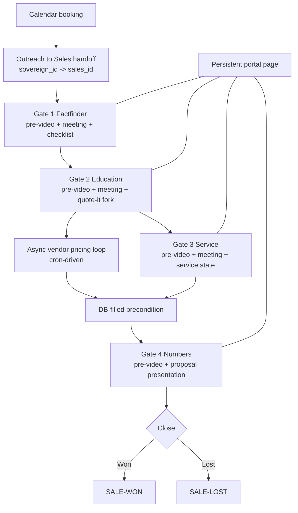

# Sales Cycle Flow

This visual companion shows the full sales cycle as one gated runtime: calendar booking creates the spine, Gate 1 through Gate 4 execute in order, the vendor loop runs in parallel, and the portal stays live across the entire cycle.

Legend:
- Calendar trigger: the next meeting is booked and the stage advances.
- Cron trigger: the vendor loop runs asynchronously until all invoice-backed rows are parsed.
- Precondition trigger: Gate 4 waits until the database is fully filled.

