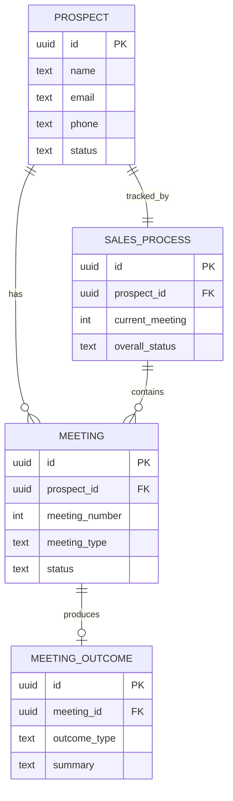

# UI ERD — Sales Navigator

**Status**: DERIVED (Read-Only Mirror)
**Authority**: UI_CONSTITUTION.md
**Version**: 1.0.0
**Hub**: HUB-SALES-NAV-20260130

---

## Derivation

This UI ERD is a **read-only mirror** of the canonical ERD. It defines what data structures the UI may display, but the UI does NOT own these structures.

> **UI ERD = Canonical ERD + Display Annotations**

---

## Core Principle

| Rule | Enforcement |
|------|-------------|
| Same entities as canonical | MANDATORY |
| Same fields as canonical | MANDATORY |
| Same relationships as canonical | MANDATORY |
| No new entities | FORBIDDEN |
| No new fields | FORBIDDEN |
| No structural changes | FORBIDDEN |

---

## UI Data Entities

### 1. Prospect (Read-Only)

| Field | Type | Display | Visibility |
|-------|------|---------|------------|
| id | uuid | Hidden | Internal |
| created_at | timestamp | Formatted date | Visible |
| name | text | Primary display | Visible |
| email | text | Contact info | Visible |
| phone | text | Contact info | Visible |
| status | text | Status badge | Visible |
| source | text | Source tag | Visible |

**UI Annotations:**
- Render `name` as primary identifier in lists
- Format `created_at` as relative time ("2 days ago")
- Display `status` as colored badge

---

### 2. Meeting (Read-Only)

| Field | Type | Display | Visibility |
|-------|------|---------|------------|
| id | uuid | Hidden | Internal |
| prospect_id | uuid | Hidden (FK) | Internal |
| meeting_number | integer | Meeting badge | Visible |
| meeting_type | text | Meeting title | Visible |
| status | text | Status indicator | Visible |
| scheduled_at | timestamp | Calendar display | Visible |
| completed_at | timestamp | Completion date | Visible |
| notes | text | Notes section | Visible |

**UI Annotations:**
- Render `meeting_number` as step indicator (1/4, 2/4, etc.)
- Display `status` as progress state (pending, in-progress, completed)
- Format `scheduled_at` in user's timezone

---

### 3. Meeting Outcome (Read-Only)

| Field | Type | Display | Visibility |
|-------|------|---------|------------|
| id | uuid | Hidden | Internal |
| meeting_id | uuid | Hidden (FK) | Internal |
| outcome_type | text | Outcome badge | Visible |
| summary | text | Summary card | Visible |
| next_steps | text | Action items | Visible |
| created_at | timestamp | Timestamp | Visible |

**UI Annotations:**
- Render `outcome_type` with semantic colors (success/warning/error)
- Display `next_steps` as checklist if structured

---

### 4. Sales Process (Read-Only)

| Field | Type | Display | Visibility |
|-------|------|---------|------------|
| id | uuid | Hidden | Internal |
| prospect_id | uuid | Hidden (FK) | Internal |
| current_meeting | integer | Progress indicator | Visible |
| overall_status | text | Status badge | Visible |
| started_at | timestamp | Start date | Visible |
| completed_at | timestamp | Completion date | Visible |
| final_outcome | text | Final result | Visible |

**UI Annotations:**
- Render `current_meeting` as progress bar (0-4 steps)
- Display `overall_status` as primary status indicator
- Show `final_outcome` prominently when process complete

---

## Entity Relationships (Mirrored)



---

## UI Read Permissions

| Entity | Create | Read | Update | Delete |
|--------|--------|------|--------|--------|
| Prospect | - | YES | - | - |
| Meeting | - | YES | - | - |
| Meeting Outcome | - | YES | - | - |
| Sales Process | - | YES | - | - |

**Note:** UI has READ-ONLY access. All mutations go through hub M layer via events.

---

## Data Flow Pattern

```
Supabase (Source of Truth)
        |
        v
Hub Data Layer (src/data/)
        |
        v
Hub App Layer (src/app/)
        |
        v
React Query / Context
        |
        v
UI Components (READ-ONLY display)
        |
        v
User Interaction
        |
        v
Event Emission (Intent only)
        |
        v
Hub App Layer (processes intent)
        |
        v
Supabase (mutation)
```

---

## Validation Criteria

| # | Check | Pass Condition |
|---|-------|----------------|
| 1 | Entities match canonical ERD | 1:1 mapping |
| 2 | Fields match canonical ERD | No additions |
| 3 | Relationships match canonical ERD | Same cardinality |
| 4 | UI has no write access | Read-only verified |

---

## Document Control

| Field | Value |
|-------|-------|
| Created | 2026-01-30 |
| Last Modified | 2026-01-30 |
| Version | 1.0.0 |
| Status | DERIVED |
| Authority | UI_CONSTITUTION.md |
| Hub | HUB-SALES-NAV-20260130 |
| Mirrors | Canonical ERD (when created) |
